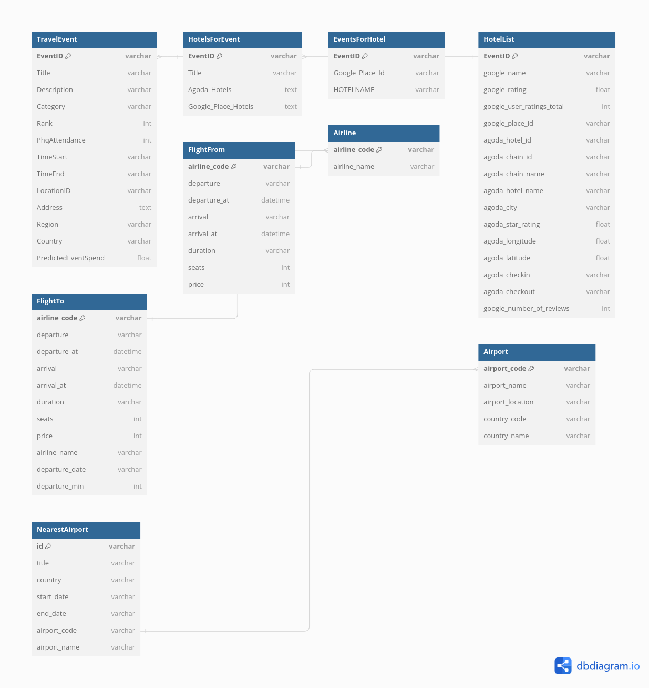

# 여행 보조 프로그램

## 프로젝트 개요

이 프로젝트는 여행지 주변의 행사 정보를 바탕으로 비행기편, 숙소, 식당 등을 추천해주는 여행 보조 프로그램입니다. 사용자는 특정 지역의 행사 정보를 통해 더 나은 여행 계획을 세울 수 있으며, 이를 바탕으로 항공편과 숙소, 그리고 식당까지 추천받을 수 있습니다.

이 프로그램은 두 가지 주요 컴포넌트로 구성됩니다:

1. **Django**: 사용자 인터페이스를 제공하며, AWS RDS에서 데이터를 가져와 사용자에게 정보를 제공합니다.
2. **Airflow**: 다양한 API에서 데이터를 수집하여 AWS S3에 저장한 뒤, AWS Redshift로 적재하여 Django가 이를 사용하도록 합니다.

프로젝트는 Docker 컨테이너를 통해 Airflow와 Django가 각각의 인스턴스로 구성되며, AWS에서 호스팅됩니다.

## 시스템 아키텍처

![시스템 아키텍처 다이어그램]

위의 다이어그램은 API에서 수집된 데이터가 Airflow를 통해 AWS S3 및 RDS에 저장되고, Django를 통해 사용자에게 제공되는 구조를 보여줍니다.


## ERD (Entity-Relationship Diagram)

프로젝트의 데이터베이스 구조를 시각화한 ERD는 아래와 같습니다:




## 주요 기능

- **행사 정보 수집 및 추천**: Predicthq API를 사용하여 전 세계의 행사 정보를 수집하고 이를 분석하여 사용자에게 추천합니다.
- **항공편 및 숙소 정보 제공**: Amadeus API를 활용하여 사용자 위치와 행사 근처의 항공편 및 숙소 정보를 제공하며, Google Place API를 통해 주변의 식당 및 카페 정보도 제공합니다.
- **데이터 관리**: AWS Redshift를 이용해 대용량 데이터를 관리하고, Django를 통해 사용자 요청 시 실시간으로 데이터를 제공합니다.

## 설치 및 설정 가이드

### 1. 환경 변수 설정
프로젝트 실행에 필요한 환경 변수는 `variables.json` 파일에 정의되어 있으며, 아래와 같은 형식으로 설정됩니다:

```json
{
    "GOOGLE_API_KEY": "YOUR_GOOGLE_API_KEY",
    "predicthq_ACCESS_TOKEN": "YOUR_PREDICTHQ_ACCESS_TOKEN",
    "redshift_schema_places": "redshift_schema_places",
    "redshift_table_nearest": "nearest_airports",
    "redshift_table_places": "events_places",
    "s3_bucket_name": "s3_bucket_name"
}
```

### 2. Docker 컨테이너 실행
프로젝트는 Docker를 통해 실행됩니다. Docker Compose 파일을 사용하여 Airflow와 Django를 구성하며, AWS에 배포된 인프라와 연결합니다.

### 3. AWS 설정
AWS S3, RDS, 그리고 Redshift를 활용하여 데이터를 관리합니다. 아래는 주요 설정 정보입니다:

- **AWS S3**: `s3_bucket_name` 버킷을 사용하여 CSV 데이터를 저장합니다.
- **AWS Redshift**: 대용량 데이터는 Redshift 클러스터에 저장되어 분석됩니다.

## 사용법

1. **프로그램 실행**: Docker Compose를 통해 Airflow 및 Django 컨테이너를 실행합니다.
2. **데이터 수집**: Airflow에서 DAG를 실행하여 API로부터 데이터를 수집하고, S3 및 Redshift에 저장합니다.
3. **웹 인터페이스 접근**: Django를 통해 웹 인터페이스에 접근하여 행사, 항공편, 숙소 등의 정보를 확인할 수 있습니다.

## 대시보드

프로젝트에는 사용자를 위한 대시보드가 포함되어 있으며, 다음과 같은 기능을 제공합니다:

- **행사 정보 시각화**: 참가자 수, 행사 규모 등 다양한 지표를 시각화합니다.
- **항공편 및 숙소 정보**: 사용자가 관심 있는 지역의 항공편 및 숙소 정보를 검색하고 필터링할 수 있습니다.


